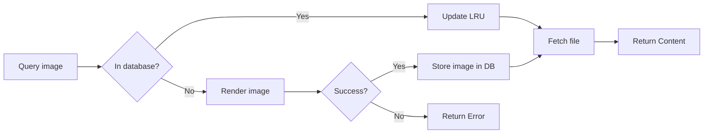

Previewer design doc
====================


The previewer is backed by a cache with file system based store for
the images.

Previews include both thumbnails and rendered (processed) images.

The cache
---------

The cache: a sqlite database with the following columns in the `cache_items` table.

`id`: unique ID of the entry.
`path`: the source path.
`dimension`: the max dimentsion. XXX how does this work for different crops?
`last_access`: last recently used. Each time the preview is pulled from cache this is updated
`created`: date of last generation.
`render`: a UNIQUE digest of the render parameters.
`target`: a generated file name

```sql
CREATE TABLE cache_items (\
       id INTEGER PRIMARY KEY AUTOINCREMENT,\
       path TEXT NOT NULL,\
       last_access INTEGER,\
       created INTEGER,\
       dimension INTEGER,\
       render TEXT NOT NULL,\
       target TEXT NOT NULL,\
       UNIQUE (path, dimension, render));\
```

The file backend
----------------

In a fixed location the file are stored, split into subdirs based on the
name.

Render params
-------------

R(): the rendering function
f: the source image file
params: the rendering params
P: the resulting preview

R(f, params) -> P

In short the rendering of a file with params always lead to the same
result.

Note: params always include the dimensions of the output.

Logic
-----

# Getting a preview



An image is in a database if `path`, `dimension` and `render` do
match.

# Cache cleanup

Define an age threshold.

Query all the cache items that have LRU older than threshold.
Delete the corresponding files.

